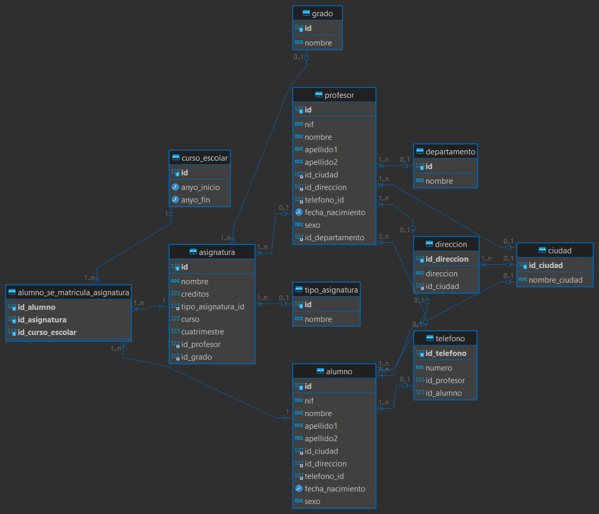

# UNIVERSIDAD


1. 

   

   


# Consultas sobre una tabla

1. Devuelve un listado con el primer apellido, segundo apellido y el nombre de
    todos los alumnos. El listado deberá estar ordenado alfabéticamente de
    menor a mayor por el primer apellido, segundo apellido y nombre.

  ```sql
  SELECT apellido1, apellido2, nombre
  FROM alumno
  ORDER BY apellido1 ASC, apellido2 ASC, nombre ASC;
  
  +------------+------------+--------+
  | apellido1  | apellido2  | nombre |
  +------------+------------+--------+
  | Fernández  | Hernández  | Sergio |
  | Fernández  | Rodríguez  | Ana    |
  | García     | Hernández  | Sara   |
  | García     | Martínez   | Pablo  |
  | Gómez      | López      | Marina |
  | Gómez      | Pérez      | Carlos |
  | González   | López      | María  |
  | Hernández  | Sánchez    | Elena  |
  | López      | Gómez      | Javier |
  | Martínez   | Fernández  | David  |
  | Martínez   | Gómez      | Carmen |
  | Martínez   | Hernández  | Juan   |
  | Pérez      | García     | Laura  |
  | Pérez      | González   | Luisa  |
  | Sánchez    | Martínez   | Pedro  |
  +------------+------------+--------+
  ```

  

2. Averigua el nombre y los dos apellidos de los alumnos que no han dado de
    alta su número de teléfono en la base de datos.

  ```sql
  SELECT a.nombre, a.apellido1, a.apellido2
  FROM alumno AS a
  LEFT JOIN telefono AS t ON t.id_alumno = a.id
  WHERE t.id_telefono IS NULL;
  
  +--------+------------+------------+
  | nombre | apellido1  | apellido2  |
  +--------+------------+------------+
  | Ana    | Fernández  | Rodríguez  |
  +--------+------------+------------+
  ```

  

3. Devuelve el listado de los alumnos que nacieron en 1999.

   ```sql
   SELECT nombre, apellido1, apellido2
   FROM alumno
   WHERE YEAR(fecha_nacimiento) = 1999;
   
   +--------+-----------+-----------+
   | nombre | apellido1 | apellido2 |
   +--------+-----------+-----------+
   | Carlos | Gómez     | Pérez     |
   +--------+-----------+-----------+
   ```

   

4. Devuelve el listado de profesores que no han dado de alta su número de
    teléfono en la base de datos y además su nif termina en K

  ```sql
  SELECT nombre, apellido1, apellido2, nif
  FROM profesor
  WHERE id NOT IN (SELECT id_profesor FROM telefono WHERE id_profesor IS NOT NULL)
  AND RIGHT(nif, 1) = 'K';
  
  +--------+------------+-----------+-----------+
  | nombre | apellido1  | apellido2 | nif       |
  +--------+------------+-----------+-----------+
  | Pablo  | Fernández  | García    | 65498723K |
  +--------+------------+-----------+-----------+
  ```

  

5. Devuelve el listado de las asignaturas que se imparten en el primer
    cuatrimestre, en el tercer curso del grado que tiene el identificador 7.

  ```sql
  SELECT id, nombre
  FROM asignatura
  WHERE cuatrimestre = 1 
  AND curso = 3;
  
  
  +----+---------------------+
  | id | nombre              |
  +----+---------------------+
  |  3 | Química I           |
  |  5 | Historia del Arte I |
  +----+---------------------+
  ```

  # Consultas multitabla (Composición interna)

  1. Devuelve un listado con los datos de todas las alumnas que se han matriculado alguna vez en el Grado en Ingeniería Informática (Plan 2015).

```sql

SELECT a.id AS id_alumno, a.nif, a.nombre, a.apellido1, a.apellido2
FROM alumno a
JOIN alumno_se_matricula_asignatura am ON a.id = am.id_alumno
JOIN asignatura asi ON am.id_asignatura = asi.id
JOIN grado g ON asi.id_grado = g.id
WHERE a.sexo = 'M'
AND g.nombre = 'Ingeniería Informática (Plan 2015)';

+-----------+-----------+--------+------------+------------+
| id_alumno | nif       | nombre | apellido1  | apellido2  |
+-----------+-----------+--------+------------+------------+
|         1 | 12345678A | María  | González   | López      |
|         1 | 12345678A | María  | González   | López      |
|         3 | 34567890C | Laura  | Pérez      | García     |
|         3 | 34567890C | Laura  | Pérez      | García     |
|         3 | 34567890C | Laura  | Pérez      | García     |
|         5 | 56789012E | Ana    | Fernández  | Rodríguez  |
|         5 | 56789012E | Ana    | Fernández  | Rodríguez  |
|         5 | 56789012E | Ana    | Fernández  | Rodríguez  |
|         7 | 78901234G | Sara   | García     | Hernández  |
|         7 | 78901234G | Sara   | García     | Hernández  |
|         7 | 78901234G | Sara   | García     | Hernández  |
|         9 | 90123456I | Elena  | Hernández  | Sánchez    |
|         9 | 90123456I | Elena  | Hernández  | Sánchez    |
|         9 | 90123456I | Elena  | Hernández  | Sánchez    |
|        11 | 11223344K | Luisa  | Pérez      | González   |
|        11 | 11223344K | Luisa  | Pérez      | González   |
|        11 | 11223344K | Luisa  | Pérez      | González   |
|        13 | 33445566M | Carmen | Martínez   | Gómez      |
|        13 | 33445566M | Carmen | Martínez   | Gómez      |
|        13 | 33445566M | Carmen | Martínez   | Gómez      |
+-----------+-----------+--------+------------+------------+

```


​    

  2. Devuelve un listado con todas las asignaturas ofertadas en el Grado en Ingeniería Informática (Plan 2015).

```sql

SELECT a.id AS id_asignatura, a.nombre AS nombre_asignatura
FROM asignatura a
JOIN grado g ON a.id_grado = g.id
WHERE g.nombre = 'Ingeniería Informática (Plan 2015)';

+---------------+-----------------------+
| id_asignatura | nombre_asignatura     |
+---------------+-----------------------+
|             1 | Matemáticas I         |
|             2 | Física I              |
|             4 | Inglés I              |
|             5 | Historia del Arte I   |
|             6 | Programación I        |
|             7 | Cálculo II            |
|             8 | Física II             |
|             9 | Química II            |
|            10 | Inglés II             |
|            11 | Historia del Arte II  |
|            12 | Programación II       |
|            13 | Matemáticas III       |
|            14 | Física III            |
|            15 | Química III           |
|            16 | Inglés III            |
|            17 | Historia del Arte III |
|            18 | Programación III      |
|            19 | Matemáticas IV        |
|            20 | Física IV             |
|            21 | Química IV            |
|            22 | Inglés IV             |
|            23 | Historia del Arte IV  |
|            24 | Programación IV       |
|            25 | Matemáticas V         |
|            26 | Física V              |
|            27 | Química V             |
|            28 | Inglés V              |
|            29 | Historia del Arte V   |
|            30 | Programación V        |
|            31 | Matemáticas VI        |
|            32 | Física VI             |
|            33 | Química VI            |
|            34 | Inglés VI             |
|            35 | Historia del Arte VI  |
|            36 | Programación VI       |
|            37 | Matemáticas VII       |
|            38 | Física VII            |
|            39 | Química VII           |
|            40 | Inglés VII            |
|            41 | Historia del Arte VII |
|            42 | Programación VII      |
+---------------+-----------------------+

```


​    

  3. Devuelve un listado de los profesores junto con el nombre del 

     departamento al que están vinculados. El listado debe devolver cuatro
     columnas, primer apellido, segundo apellido, nombre y nombre del
     departamento. El resultado estará ordenado alfabéticamente de menor a
     mayor por los apellidos y el nombre.

```sql


SELECT p.apellido1, p.apellido2, p.nombre, d.nombre AS nombre_departamento
FROM profesor p
JOIN departamento d ON p.id_departamento = d.id
ORDER BY p.apellido1, p.apellido2, p.nombre;

+------------+------------+--------+---------------------------------------------+
| apellido1  | apellido2  | nombre | nombre_departamento                         |
+------------+------------+--------+---------------------------------------------+
| García     | Fernández  | Ana    | Departamento de Economía                    |
| García     | Pérez      | Juan   | Departamento de Matemáticas                 |
| Hernández  | Sánchez    | Laura  | Departamento de Lenguas                     |
| López      | Martínez   | Carlos | Departamento de Arte                        |
| Martín     | Gómez      | Javier | Departamento de Ciencias de la Computación  |
| Martínez   | López      | María  | Departamento de Historia                    |
| Pérez      | Rodríguez  | Elena  | Departamento de Física                      |
| Rodríguez  | González   | Pedro  | Departamento de Ciencias Naturales          |
+------------+------------+--------+---------------------------------------------+

```


​    

  4. Devuelve un listado con el nombre de las asignaturas, año de inicio y año de fin del curso escolar del alumno con nif 26902806M.

```sql

SELECT a.nombre AS nombre_asignatura, c.anyo_inicio, c.anyo_fin
FROM alumno_se_matricula_asignatura as am
JOIN asignatura as a ON am.id_asignatura = a.id
JOIN curso_escolar as c ON am.id_curso_escolar = c.id
JOIN alumno as al ON am.id_alumno = al.id
WHERE al.nif = '26902806M';

+----------------------+-------------+----------+
| nombre_asignatura    | anyo_inicio | anyo_fin |
+----------------------+-------------+----------+
| Inglés VI            |        2013 |     2014 |
| Historia del Arte VI |        2013 |     2014 |
| Programación VI      |        2013 |     2014 |
+----------------------+-------------+----------+

```


​    

  5. Devuelve un listado con el nombre de todos los departamentos que tienen 

     profesores que imparten alguna asignatura en el Grado en Ingeniería
     Informática (Plan 2015).

```sql


SELECT DISTINCT d.nombre AS nombre_departamento
FROM departamento AS d
JOIN profesor AS p ON d.id = p.id_departamento
JOIN asignatura AS a ON p.id = a.id_profesor
JOIN grado AS g ON a.id_grado = g.id
WHERE g.nombre LIKE '%Ingeniería Informática (Plan 2015)%';

+---------------------------------------------+
| nombre_departamento                         |
+---------------------------------------------+
| Departamento de Matemáticas                 |
| Departamento de Ciencias Naturales          |
| Departamento de Lenguas                     |
| Departamento de Arte                        |
| Departamento de Economía                    |
| Departamento de Física                      |
| Departamento de Historia                    |
| Departamento de Ciencias de la Computación  |
+---------------------------------------------+

```


​    

  6. Devuelve un listado con todos los alumnos que se han matriculado en alguna asignatura durante el curso escolar 2018/2019.

```sql

SELECT DISTINCT a.nombre, a.apellido1, a.apellido2
FROM alumno AS a
JOIN alumno_se_matricula_asignatura as mat ON a.id = mat.id_alumno
JOIN curso_escolar as c ON mat.id_curso_escolar = c.id
WHERE c.anyo_inicio = 2018 AND c.anyo_fin = 2019;

+--------+------------+------------+
| nombre | apellido1  | apellido2  |
+--------+------------+------------+
| Juan   | Martínez   | Hernández  |
| Ana    | Fernández  | Rodríguez  |
+--------+------------+------------+

```


​    

# Consultas multitabla (Composición externa)

Resuelva todas las consultas utilizando las cláusulas LEFT JOIN y RIGHT JOIN.

1. Devuelve un listado con los nombres de todos los profesores y los
    departamentos que tienen vinculados. El listado también debe mostrar
    aquellos profesores que no tienen ningún departamento asociado. El listado
    debe devolver cuatro columnas, nombre del departamento, primer apellido,
    segundo apellido y nombre del profesor. El resultado estará ordenado
    alfabéticamente de menor a mayor por el nombre del departamento,
    apellidos y el nombre.

  ```sql
  SELECT d.nombre AS nombre_departamento, p.apellido1, p.apellido2, p.nombre
  FROM profesor as p
  LEFT JOIN departamento as  ON p.id_departamento = d.id
  ORDER BY nombre_departamento ASC, p.apellido1 ASC, p.apellido2 ASC, p.nombre ASC;
  
  +---------------------------------------------+------------+------------+---------+
  | nombre_departamento                         | apellido1  | apellido2  | nombre  |
  +---------------------------------------------+------------+------------+---------+
  | NULL                                        | Fernández  | García     | Pablo   |
  | NULL                                        | Gómez      | Pérez      | David   |
  | NULL                                        | González   | Hernández  | Luisa   |
  | NULL                                        | Hernández  | García     | Sara    |
  | NULL                                        | López      | Martínez   | Alberto |
  | NULL                                        | Martínez   | Sánchez    | Carmen  |
  | NULL                                        | Sánchez    | Martínez   | Sergio  |
  | Departamento de Arte                        | López      | Martínez   | Carlos  |
  | Departamento de Ciencias de la Computación  | Martín     | Gómez      | Javier  |
  | Departamento de Ciencias Naturales          | Rodríguez  | González   | Pedro   |
  | Departamento de Economía                    | García     | Fernández  | Ana     |
  | Departamento de Física                      | Pérez      | Rodríguez  | Elena   |
  | Departamento de Historia                    | Martínez   | López      | María   |
  | Departamento de Lenguas                     | Hernández  | Sánchez    | Laura   |
  | Departamento de Matemáticas                 | García     | Pérez      | Juan    |
  +---------------------------------------------+------------+------------+---------+
  ```

  

2. Devuelve un listado con los profesores que no están asociados a un
    departamento.

  ```sql
  SELECT p.apellido1, p.apellido2, p.nombre
  FROM profesor AS p
  LEFT JOIN departamento AS d ON p.id_departamento = d.id
  WHERE d.id IS NULL
  ORDER BY p.apellido1 ASC, p.apellido2 ASC, p.nombre ASC;
  
  +-----------+------------+--------+
  | apellido1 | apellido2  | nombre |
  +-----------+------------+--------+
  | García    | Fernández  | Ana    |
  | López     | Martínez   | Carlos |
  +-----------+------------+--------+
  ```

  

3. Devuelve un listado con los departamentos que no tienen profesores
    asociados.

  ```sql
  SELECT d.nombre AS nombre_departamento
  FROM departamento as d
  LEFT JOIN profesor as p ON d.id = p.id_departamento
  WHERE p.id IS NULL;
  
  +---------------------------+
  | nombre_departamento       |
  +---------------------------+
  | Departamento de Economía  |
  +---------------------------+
  ```

  

4. Devuelve un listado con los profesores que no imparten ninguna asignatura.

   ```sql
   
   ```

   

5. Devuelve un listado con las asignaturas que no tienen un profesor asignado.

   ```sql
   SELECT a.nombre
   FROM asignatura as a
   LEFT JOIN profesor as p ON a.id_profesor = p.id
   WHERE p.id IS NULL;
   
   +--------------+
   | nombre       |
   +--------------+
   | Química III  |
   +--------------+
   ```

   

6. Devuelve un listado con todos los departamentos que tienen alguna
    asignatura que no se haya impartido en ningún curso escolar. El resultado
    debe mostrar el nombre del departamento y el nombre de la asignatura que
    no se haya impartido nunca.

  ```sql
  SELECT a.nombre AS nombre_asignatura
  FROM asignatura as a
  LEFT JOIN alumno_se_matricula_asignatura as ama ON a.id = ama.id_asignatura
  WHERE ama.id_asignatura IS NULL;
  
  +-------------------+
  | nombre_asignatura |
  +-------------------+
  | Física III        |
  +-------------------+
  ```

  # Consultas resumen

  1. Devuelve el número total de alumnas que hay.

     ```sql
     SELECT COUNT(*) AS 'total alumnas'
     FROM alumno
     WHERE sexo = 'M';
     
     +---------------+
     | total alumnas |
     +---------------+
     |             8 |
     +---------------+
     ```

     

  2. Calcula cuántos alumnos nacieron en 1999.

     ```sql
     SELECT COUNT(*) AS 'total alumnos 1999'
     FROM alumno
     WHERE YEAR(fecha_nacimiento) = 1999;
     
     +--------------------+
     | total alumnos 1999 |
     +--------------------+
     |                  1 |
     +--------------------+
     ```

     

  3. Calcula cuántos profesores hay en cada departamento. El resultado sólo 

     debe mostrar dos columnas, una con el nombre del departamento y otra
     con el número de profesores que hay en ese departamento. El resultado
     sólo debe incluir los departamentos que tienen profesores asociados y
     deberá estar ordenado de mayor a menor por el número de profesores.

```sql

SELECT d.nombre AS 'nombre del Departamento', COUNT(p.id) AS 'numero de Profesores'
FROM departamento as d
JOIN profesor as p ON d.id = p.id_departamento
GROUP BY d.nombre
ORDER BY COUNT(p.id) DESC;

+---------------------------------------------+-----------------------+
| nombre del Departamento                     | numero de Profesores  |
+---------------------------------------------+-----------------------+
| Departamento de Lenguas                     |                     3 |
| Departamento de Matemáticas                 |                     2 |
| Departamento de Historia                    |                     2 |
| Departamento de Ciencias Naturales          |                     2 |
| Departamento de Física                      |                     2 |
| Departamento de Arte                        |                     1 |
| Departamento de Ciencias de la Computación  |                     1 |
+---------------------------------------------+-----------------------+

```


​    

  4. Devuelve un listado con todos los departamentos y el número de profesores 

     que hay en cada uno de ellos. Tenga en cuenta que pueden existir
     departamentos que no tienen profesores asociados. Estos departamentos
     también tienen que aparecer en el listado.

```sql

SELECT d.nombre AS 'nombre del Departamento', COUNT(p.id) AS 'numero de Profesores'
FROM departamento as d
LEFT JOIN profesor as p ON d.id = p.id_departamento
GROUP BY d.nombre;

+---------------------------------------------+----------------------+
| nombre del Departamento                     | numero de Profesores |
+---------------------------------------------+----------------------+
| Departamento de Matemáticas                 |                    2 |
| Departamento de Historia                    |                    2 |
| Departamento de Ciencias Naturales          |                    2 |
| Departamento de Lenguas                     |                    3 |
| Departamento de Arte                        |                    1 |
| Departamento de Economía                    |                    0 |
| Departamento de Ciencias de la Computación  |                    1 |
| Departamento de Física                      |                    2 |
+---------------------------------------------+----------------------+
```


​    

  5. Devuelve un listado con el nombre de todos los grados existentes en la base

     de datos y el número de asignaturas que tiene cada uno. Tenga en cuenta que pueden existir grados que no tienen asignaturas asociadas. Estos grados
     también tienen que aparecer en el listado. El resultado deberá estar
     ordenado de mayor a menor por el número de asignaturas.

```sql

SELECT g.nombre AS 'nombre del Grado', COUNT(a.id) AS 'numero de Asignaturas'
FROM grado as g
LEFT JOIN asignatura as a ON g.id = a.id_grado
GROUP BY g.nombre
ORDER BY COUNT(a.id) DESC;

+--------------------------------------+-----------------------+
| nombre del Grado                     | numero de Asignaturas |
+--------------------------------------+-----------------------+
| Ingeniería Informática (Plan 2015)   |                    41 |
| Derecho (Plan 2013)                  |                     1 |
| Medicina (Plan 2015)                 |                     0 |
| Arquitectura (Plan 2011)             |                     0 |
| Biología (Plan 2016)                 |                     0 |
| Economía (Plan 2017)                 |                     0 |
| Psicología (Plan 2015)               |                     0 |
| Comunicación (Plan 2014)             |                     0 |
| Filosofía (Plan 2019)                |                     0 |
| Matemáticas (Plan 2013)              |                     0 |
+--------------------------------------+-----------------------+

```


​    

  6. Devuelve un listado con el nombre de todos los grados existentes en la base 

     de datos y el número de asignaturas que tiene cada uno, de los grados que
     tengan más de 40 asignaturas asociadas.

```sql


SELECT g.nombre AS 'Nombre del Grado', COUNT(a.id) AS 'numero de Asignaturas'
FROM grado as g
JOIN asignatura as a ON g.id = a.id_grado
GROUP BY g.nombre
HAVING COUNT(a.id) > 40
ORDER BY COUNT(a.id) DESC;

+--------------------------------------+-----------------------+
| Nombre del Grado                     | numero de Asignaturas |
+--------------------------------------+-----------------------+
| Ingeniería Informática (Plan 2015)   |                    41 |
+--------------------------------------+-----------------------+

```


​    

  7. Devuelve un listado que muestre el nombre de los grados y la suma del 

     número total de créditos que hay para cada tipo de asignatura. El resultado
     debe tener tres columnas: nombre del grado, tipo de asignatura y la suma
     de los créditos de todas las asignaturas que hay de ese tipo. Ordene el
     resultado de mayor a menor por el número total de crédidos.

```sql

SELECT g.nombre AS 'nombre grado', t.nombre AS 'tipo asignatura', SUM(a.creditos) AS 'suma de creditos'
FROM grado as g
JOIN asignatura as a ON g.id = a.id_grado
JOIN tipo_asignatura as t ON a.tipo_asignatura_id = t.id
GROUP BY g.nombre, t.nombre
ORDER BY SUM(a.creditos) DESC;

+--------------------------------------+-----------------+------------------+
| nombre grado                         | tipo asignatura | suma de creditos |
+--------------------------------------+-----------------+------------------+
| Ingeniería Informática (Plan 2015)   | Básica          |              162 |
| Ingeniería Informática (Plan 2015)   | Optativa        |               42 |
| Ingeniería Informática (Plan 2015)   | Obligatoria     |               42 |
| Derecho (Plan 2013)                  | Básica          |                6 |
+--------------------------------------+-----------------+------------------+

```


​    

  8. Devuelve un listado que muestre cuántos alumnos se han matriculado de 

     alguna asignatura en cada uno de los cursos escolares. El resultado deberá
     mostrar dos columnas, una columna con el año de inicio del curso escolar y
     otra con el número de alumnos matriculados.

```sql

SELECT ce.anyo_inicio AS 'año inicio', COUNT(DISTINCT am.id_alumno) AS 'numero alumnos'
FROM curso_escolar as ce
LEFT JOIN alumno_se_matricula_asignatura as am ON ce.id = am.id_curso_escolar
GROUP BY ce.anyo_inicio
ORDER BY ce.anyo_inicio;

+-------------+----------------+
| año inicio  | numero alumnos |
+-------------+----------------+
|        2013 |             13 |
|        2014 |              0 |
|        2015 |              0 |
|        2016 |              0 |
|        2017 |              0 |
|        2018 |              2 |
|        2019 |              1 |
+-------------+----------------+

```


​    

  9. Devuelve un listado con el número de asignaturas que imparte cada

     profesor. El listado debe tener en cuenta aquellos profesores que no
     imparten ninguna asignatura. El resultado mostrará cinco columnas: id,
     nombre, primer apellido, segundo apellido y número de asignaturas. El
     resultado estará ordenado de mayor a menor por el número de asignaturas.

```sql
SELECT p.id, p.nombre, p.apellido1, p.apellido2, COUNT(a.id) AS 'asignaturas'
FROM profesor as p
LEFT JOIN asignatura as a ON p.id = a.id_profesor
GROUP BY p.id, p.nombre, p.apellido1, p.apellido2
ORDER BY COUNT(a.id) DESC;

+----+---------+------------+------------+-------------+
| id | nombre  | apellido1  | apellido2  | asignaturas |
+----+---------+------------+------------+-------------+
|  1 | Juan    | García     | Pérez      |           4 |
|  3 | Pedro   | Rodríguez  | González   |           4 |
|  4 | Laura   | Hernández  | Sánchez    |           3 |
|  5 | Carlos  | López      | Martínez   |           3 |
|  6 | Ana     | García     | Fernández  |           3 |
|  8 | Elena   | Pérez      | Rodríguez  |           3 |
|  9 | Sergio  | Sánchez    | Martínez   |           3 |
| 10 | Luisa   | González   | Hernández  |           3 |
| 11 | Pablo   | Fernández  | García     |           3 |
| 12 | Carmen  | Martínez   | Sánchez    |           3 |
|  2 | María   | Martínez   | López      |           2 |
|  7 | Javier  | Martín     | Gómez      |           2 |
| 13 | David   | Gómez      | Pérez      |           2 |
| 14 | Sara    | Hernández  | García     |           2 |
| 15 | Alberto | López      | Martínez   |           1 |
+----+---------+------------+------------+-------------+
```

# Subconsultas

1. Devuelve todos los datos del alumno más joven.

   ```sql
   
   SELECT id, nif, nombre, apellido1, apellido2, id_ciudad, id_direccion, telefono_id, fecha_nacimiento, sexo
   FROM alumno
   WHERE fecha_nacimiento = (SELECT MIN(fecha_nacimiento) FROM alumno);
   
   +----+-----------+--------+------------+-----------+-----------+--------------+-------------+------------------+------+
   | id | nif       | nombre | apellido1  | apellido2 | id_ciudad | id_direccion | telefono_id | fecha_nacimiento | sexo |
   +----+-----------+--------+------------+-----------+-----------+--------------+-------------+------------------+------+
   |  9 | 90123456I | Elena  | Hernández  | Sánchez   |         2 |            9 |           9 | 1990-07-20       | M    |
   +----+-----------+--------+------------+-----------+-----------+--------------+-------------+------------------+------+
   ```

   

2. Devuelve un listado con los profesores que no están asociados a un
    departamento.

  ```sql
  SELECT p.id, p.nif, p.nombre, p.apellido1, p.apellido2, p.id_ciudad, p.id_direccion, p.telefono_id, p.fecha_nacimiento, p.sexo
  FROM profesor as p
  LEFT JOIN departamento as d ON p.id_departamento = d.id
  WHERE p.id_departamento IS NULL;
  
  +----+-----------+--------+-----------+------------+-----------+--------------+-------------+------------------+------+
  | id | nif       | nombre | apellido1 | apellido2  | id_ciudad | id_direccion | telefono_id | fecha_nacimiento | sexo |
  +----+-----------+--------+-----------+------------+-----------+--------------+-------------+------------------+------+
  |  5 | 13579246E | Carlos | López     | Martínez   |         5 |            5 |        NULL | 1984-07-30       | H    |
  |  6 | 24681359F | Ana    | García    | Fernández  |         3 |            6 |        NULL | 1981-02-18       | M    |
  +----+-----------+--------+-----------+------------+-----------+--------------+-------------+------------------+------+
  ```

  

3. Devuelve un listado con los departamentos que no tienen profesores
    asociados.

  ```sql
  SELECT id, nombre
  FROM departamento
  WHERE id NOT IN (
      SELECT DISTINCT id_departamento
      FROM profesor
      WHERE id_departamento IS NOT NULL
  );
  
  +----+---------------------------+
  | id | nombre                    |
  +----+---------------------------+
  |  6 | Departamento de Economía  |
  +----+---------------------------+
  ```

  

4. Devuelve un listado con los profesores que tienen un departamento
    asociado y que no imparten ninguna asignatura.

  ```sql
  SELECT p.id, p.nombre, p.apellido1, p.apellido2,
      (SELECT COUNT(a.id) FROM asignatura a WHERE a.id_profesor = p.id) AS numero_asignaturas
  FROM profesor p
  WHERE p.id_departamento IS NOT NULL
      AND (SELECT COUNT(a.id) FROM asignatura a WHERE a.id_profesor = p.id) = 0;
      
  +------+--------+-----------+-----------+--------------------+
  | id   | nombre | apellido1 | apellido2 | numero_asignaturas |
  +------+--------+-----------+-----------+--------------------+
  |   16 | Marta  | Gómez     | Martínez  |                  0 |
  +------+--------+-----------+-----------+--------------------+
  ```

  

5. Devuelve un listado con las asignaturas que no tienen un profesor asignado.

   ```sql
   SELECT id, nombre
   FROM asignatura
   WHERE id_profesor IS NULL;
   
   +----+--------------+
   | id | nombre       |
   +----+--------------+
   | 15 | Química III  |
   +----+--------------+
   ```

   

6. Devuelve un listado con todos los departamentos que no han impartido
    asignaturas en ningún curso escolar.

  ```sql
  SELECT id, nombre
  FROM departamento
  WHERE id NOT IN (
      SELECT d.id
      FROM departamento d
      JOIN profesor p ON d.id = p.id_departamento
      JOIN asignatura a ON p.id = a.id_profesor
      JOIN alumno_se_matricula_asignatura m ON a.id = m.id_asignatura
  );
  
  +----+---------------------------+
  | id | nombre                    |
  +----+---------------------------+
  |  6 | Departamento de Economía  |
  +----+---------------------------+
  ```

  


# VISTAS

1. Vista de los alumnos

   ```sql
   CREATE VIEW vista_alumnos AS
   
   SELECT id, nif, nombre, apellido1, apellido2, id_ciudad, id_direccion, telefono_id, fecha_nacimiento, sexo
   FROM alumno;
   
   SELECT id, nif, nombre, apellido1, apellido2, id_ciudad, id_direccion, telefono_id, fecha_nacimiento, sexo FROM vista_alumnos;
   
   +----+-----------+--------+------------+------------+-----------+--------------+-------------+------------------+------+
   | id | nif       | nombre | apellido1  | apellido2  | id_ciudad | id_direccion | telefono_id | fecha_nacimiento | sexo |
   +----+-----------+--------+------------+------------+-----------+--------------+-------------+------------------+------+
   |  1 | 12345678A | María  | González   | López      |         1 |            1 |           1 | 1995-05-10       | M    |
   |  2 | 23456789B | Juan   | Martínez   | Hernández  |         2 |            2 |           2 | 1996-08-15       | H    |
   |  3 | 34567890C | Laura  | Pérez      | García     |         3 |            3 |           3 | 1994-03-20       | M    |
   |  4 | 45678901D | Pedro  | Sánchez    | Martínez   |         4 |            4 |           4 | 1993-11-25       | H    |
   |  5 | 56789012E | Ana    | Fernández  | Rodríguez  |         5 |            5 |        NULL | 1997-06-30       | M    |
   |  6 | 67890123F | Javier | López      | Gómez      |         5 |            6 |        NULL | 1992-09-05       | H    |
   |  7 | 78901234G | Sara   | García     | Hernández  |         2 |            7 |           7 | 1998-12-10       | M    |
   |  8 | 89012345H | David  | Martínez   | Fernández  |         1 |            8 |           8 | 1991-04-15       | H    |
   |  9 | 90123456I | Elena  | Hernández  | Sánchez    |         2 |            9 |           9 | 1990-07-20       | M    |
   | 10 | 01234567J | Carlos | Gómez      | Pérez      |         3 |           10 |          10 | 1999-02-25       | H    |
   | 11 | 11223344K | Luisa  | Pérez      | González   |         4 |           11 |          11 | 1994-10-30       | M    |
   | 12 | 26902806M | Pablo  | García     | Martínez   |         5 |           12 |          12 | 1993-03-05       | H    |
   | 13 | 33445566M | Carmen | Martínez   | Gómez      |         1 |           13 |          13 | 1996-06-10       | M    |
   | 14 | 44556677N | Sergio | Fernández  | Hernández  |         2 |           14 |          14 | 1992-09-15       | H    |
   | 15 | 55667788O | Marina | Gómez      | López      |         4 |           15 |          15 | 1997-12-20       | M    |
   +----+-----------+--------+------------+------------+-----------+--------------+-------------+------------------+------+
   ```

   

2. Vista de los profesores

   ```sql
   CREATE VIEW vista_profesores AS
   
   SELECT id, nif, nombre, apellido1, apellido2, id_ciudad, id_direccion, telefono_id, fecha_nacimiento, sexo, id_departamento
   FROM profesor;
   
   SELECT id, nif, nombre, apellido1, apellido2, id_ciudad, id_direccion, telefono_id, fecha_nacimiento, sexo, id_departamento FROM vista_profesores;
   
   +----+-----------+---------+------------+------------+-----------+--------------+-------------+------------------+------+-----------------+
   | id | nif       | nombre  | apellido1  | apellido2  | id_ciudad | id_direccion | telefono_id | fecha_nacimiento | sexo | id_departamento |
   +----+-----------+---------+------------+------------+-----------+--------------+-------------+------------------+------+-----------------+
   |  1 | 12345678A | Juan    | García     | Pérez      |         1 |            1 |           1 | 1980-05-15       | H    |               1 |
   |  2 | 98765432B | María   | Martínez   | López      |         2 |            2 |           2 | 1975-08-20       | M    |               2 |
   |  3 | 54321678C | Pedro   | Rodríguez  | González   |         3 |            3 |           3 | 1982-10-10       | H    |               3 |
   |  4 | 87654321D | Laura   | Hernández  | Sánchez    |         4 |            4 |           4 | 1978-04-25       | M    |               4 |
   |  5 | 13579246E | Carlos  | López      | Martínez   |         5 |            5 |        NULL | 1984-07-30       | H    |            NULL |
   |  6 | 24681359F | Ana     | García     | Fernández  |         3 |            6 |        NULL | 1981-02-18       | M    |            NULL |
   |  7 | 36925814G | Javier  | Martín     | Gómez      |         4 |            7 |           7 | 1979-11-12       | H    |               7 |
   |  8 | 25814736H | Elena   | Pérez      | Rodríguez  |         4 |            8 |           8 | 1983-09-05       | M    |               8 |
   |  9 | 14725836I | Sergio  | Sánchez    | Martínez   |         1 |            9 |           9 | 1980-06-28       | H    |               4 |
   | 10 | 78945612J | Luisa   | González   | Hernández  |         1 |           10 |          10 | 1976-12-15       | M    |               1 |
   | 11 | 65498723K | Pablo   | Fernández  | García     |         1 |           11 |          11 | 1985-03-08       | H    |               8 |
   | 12 | 98765432L | Carmen  | Martínez   | Sánchez    |         2 |           12 |          12 | 1977-09-22       | M    |               2 |
   | 13 | 12345678M | David   | Gómez      | Pérez      |         3 |           13 |          13 | 1986-08-14       | H    |               3 |
   | 14 | 78912345N | Sara    | Hernández  | García     |         4 |           14 |          14 | 1974-10-02       | M    |               4 |
   | 15 | 45678912O | Alberto | López      | Martínez   |         5 |           15 |          15 | 1988-05-07       | H    |               5 |
   | 16 | 36925814N | Marta   | Gómez      | Martínez   |         2 |            2 |          16 | 1984-09-10       | M    |               5 |
   +----+-----------+---------+------------+------------+-----------+--------------+-------------+------------------+------+-----------------+
   ```

   

3. Vista de departamento

   ```sql
   CREATE VIEW vista_departamento AS 
   
   SELECT id, nombre
   FROM departamento;
   
   SELECT id, nombre FROM vista_departamento;
   
   +----+---------------------------------------------+
   | id | nombre                                      |
   +----+---------------------------------------------+
   |  1 | Departamento de Matemáticas                 |
   |  2 | Departamento de Historia                    |
   |  3 | Departamento de Ciencias Naturales          |
   |  4 | Departamento de Lenguas                     |
   |  5 | Departamento de Arte                        |
   |  6 | Departamento de Economía                    |
   |  7 | Departamento de Ciencias de la Computación  |
   |  8 | Departamento de Física                      |
   +----+---------------------------------------------+
   ```

   

4. Vista de grado

   ```sql
   CREATE VIEW vista_grado AS 
   
   SELECT id, nombre
   FROM grado;
   
   SELECT id, nombre FROM vista_grado;
   
   +----+--------------------------------------+
   | id | nombre                               |
   +----+--------------------------------------+
   |  1 | Ingeniería Informática (Plan 2015)   |
   |  2 | Medicina (Plan 2015)                 |
   |  3 | Derecho (Plan 2013)                  |
   |  4 | Arquitectura (Plan 2011)             |
   |  5 | Biología (Plan 2016)                 |
   |  6 | Economía (Plan 2017)                 |
   |  7 | Psicología (Plan 2015)               |
   |  8 | Comunicación (Plan 2014)             |
   |  9 | Filosofía (Plan 2019)                |
   | 10 | Matemáticas (Plan 2013)              |
   +----+--------------------------------------+
   ```

   

5. Vista de asignatura

   ```sql
   CREATE VIEW vista_asignatura AS 
   
   SELECT id, nombre, creditos, tipo_asignatura_id, curso, cuatrimestre, id_profesor, id_grado
   FROM asignatura;
   
   SELECT id, nombre, creditos, tipo_asignatura_id, curso, cuatrimestre, id_profesor, id_grado FROM vista_asignatura;
   
   +----+-----------------------+----------+--------------------+-------+--------------+-------------+----------+
   | id | nombre                | creditos | tipo_asignatura_id | curso | cuatrimestre | id_profesor | id_grado |
   +----+-----------------------+----------+--------------------+-------+--------------+-------------+----------+
   |  1 | Matemáticas I         |        6 |                 12 |     1 |            1 |           1 |        1 |
   |  2 | Física I              |        6 |                 12 |     1 |            1 |           3 |        1 |
   |  3 | Química I             |        6 |                 12 |     3 |            1 |           1 |        3 |
   |  4 | Inglés I              |        6 |                  7 |     1 |            1 |           4 |        1 |
   |  5 | Historia del Arte I   |        6 |                  9 |     3 |            1 |           5 |        1 |
   |  6 | Programación I        |        6 |                 12 |     1 |            1 |           6 |        1 |
   |  7 | Cálculo II            |        6 |                 12 |     1 |            3 |           3 |        1 |
   |  8 | Física II             |        6 |                 12 |     1 |            2 |           8 |        1 |
   |  9 | Química II            |        6 |                 12 |     1 |            2 |           9 |        1 |
   | 10 | Inglés II             |        6 |                  7 |     1 |            2 |          10 |        1 |
   | 11 | Historia del Arte II  |        6 |                  9 |     1 |            2 |          11 |        1 |
   | 12 | Programación II       |        6 |                 12 |     1 |            2 |          12 |        1 |
   ```

   

6. Vista de  los alumnos que nacieron en 1999.

   ```sql
   CREATE VIEW vista_alumnos_1999 AS 
   
   SELECT nombre, apellido1, apellido2
   FROM alumno
   WHERE YEAR(fecha_nacimiento) = 1999;
   
   
   SELECT nombre, apellido1, apellido2 FROM vista_alumnos_1999;
   
   +--------+-----------+-----------+
   | nombre | apellido1 | apellido2 |
   +--------+-----------+-----------+
   | Carlos | Gómez     | Pérez     |
   +--------+-----------+-----------+       
   ```

   

7. Vista de las alumnas que se han matriculado alguna vez en el Grado en Ingeniería Informática (Plan 2015).

   ```sql
   CREATE VIEW vista_informatica_2015 AS 
   SELECT am.id_alumno, a.nif, a.nombre, a.apellido1, a.apellido2
   FROM alumno_se_matricula_asignatura as am
   JOIN alumno as a ON am.id_alumno = a.id
   JOIN asignatura as asi ON am.id_asignatura = asi.id
   JOIN grado as g ON asi.id_grado = g.id
   WHERE a.sexo = 'M' AND g.nombre = 'Ingeniería Informática (Plan 2015)';
   
   SELECT id_alumno, nif, nombre, apellido1, apellido2 FROM vista_informatica_2015;
   
   +-----------+-----------+--------+------------+------------+
   | id_alumno | nif       | nombre | apellido1  | apellido2  |
   +-----------+-----------+--------+------------+------------+
   |         1 | 12345678A | María  | González   | López      |
   |         1 | 12345678A | María  | González   | López      |
   |         3 | 34567890C | Laura  | Pérez      | García     |
   |         3 | 34567890C | Laura  | Pérez      | García     |
   |         3 | 34567890C | Laura  | Pérez      | García     |
   |         5 | 56789012E | Ana    | Fernández  | Rodríguez  |
   |         5 | 56789012E | Ana    | Fernández  | Rodríguez  |
   |         5 | 56789012E | Ana    | Fernández  | Rodríguez  |
   |         7 | 78901234G | Sara   | García     | Hernández  |
   |         7 | 78901234G | Sara   | García     | Hernández  |
   |         7 | 78901234G | Sara   | García     | Hernández  |
   |         9 | 90123456I | Elena  | Hernández  | Sánchez    |
   |         9 | 90123456I | Elena  | Hernández  | Sánchez    |
   |         9 | 90123456I | Elena  | Hernández  | Sánchez    |
   |        11 | 11223344K | Luisa  | Pérez      | González   |
   |        11 | 11223344K | Luisa  | Pérez      | González   |
   |        11 | 11223344K | Luisa  | Pérez      | González   |
   |        13 | 33445566M | Carmen | Martínez   | Gómez      |
   |        13 | 33445566M | Carmen | Martínez   | Gómez      |
   |        13 | 33445566M | Carmen | Martínez   | Gómez      |
   +-----------+-----------+--------+------------+------------+
   ```

   

8. Vista de el nombre de las asignaturas, año de inicio y año de fin del curso escolar del alumno con nif 26902806M.

   ```sql
   CREATE VIEW vista_alumno_nif AS 
   
   SELECT a.nombre AS nombre_asignatura, c.anyo_inicio, c.anyo_fin
   FROM alumno_se_matricula_asignatura as am
   JOIN asignatura as a ON am.id_asignatura = a.id
   JOIN curso_escolar as c ON am.id_curso_escolar = c.id
   JOIN alumno as al ON am.id_alumno = al.id
   WHERE al.nif = '26902806M';
   
   SELECT nombre_asignatura, anyo_inicio, anyo_fin FROM vista_alumno_nif;
   
   +----------------------+-------------+----------+
   | nombre_asignatura    | anyo_inicio | anyo_fin |
   +----------------------+-------------+----------+
   | Inglés VI            |        2013 |     2014 |
   | Historia del Arte VI |        2013 |     2014 |
   | Programación VI      |        2013 |     2014 |
   +----------------------+-------------+----------+
   ```

   

9. Vista de los alumnos que se han matriculado en alguna asignatura durante el curso escolar 2018/2019.

   ```sql
   CREATE VIEW vista_matricula_1819 AS 
   
   SELECT DISTINCT a.nombre, a.apellido1, a.apellido2
   FROM alumno AS a
   JOIN alumno_se_matricula_asignatura as mat ON a.id = mat.id_alumno
   JOIN curso_escolar as c ON mat.id_curso_escolar = c.id
   WHERE c.anyo_inicio = 2018 AND c.anyo_fin = 2019;
   
   SELECT nombre, apellido1, apellido2 FROM vista_matricula_1819;
   
   +--------+------------+------------+
   | nombre | apellido1  | apellido2  |
   +--------+------------+------------+
   | Juan   | Martínez   | Hernández  |
   | Ana    | Fernández  | Rodríguez  |
   +--------+------------+------------+
   ```

   

10. Vista de direcciones

    ```sql
    CREATE VIEW vista_direccion AS 
    
    SELECT id_direccion, direccion, id_ciudad
    FROM direccion;
    
    SELECT id_direccion, direccion, id_ciudad FROM vista_direccion;
    
    +--------------+-----------------+-----------+
    | id_direccion | direccion       | id_ciudad |
    +--------------+-----------------+-----------+
    |            1 | Calle A, 123    |         1 |
    |            2 | Avenida B, 456  |         2 |
    |            3 | Calle C, 789    |         3 |
    |            4 | Avenida D, 101  |         4 |
    |            5 | Calle E, 111    |         5 |
    |            6 | Avenida F, 222  |         1 |
    |            7 | Calle G, 333    |         5 |
    |            8 | Avenida H, 444  |         3 |
    |            9 | Calle I, 555    |         2 |
    |           10 | Avenida J, 666  |         1 |
    |           11 | Calle K, 777    |         3 |
    |           12 | Avenida L, 888  |         2 |
    |           13 | Calle M, 999    |         3 |
    |           14 | Avenida N, 1000 |         4 |
    |           15 | Calle O, 2000   |         5 |
    +--------------+-----------------+-----------+
    ```

    

# PROCEDIMIENTOS ALMACENADOS

1. Procedimiento para crear un nuevo alumno

   ```sql
   DELIMITER //
   CREATE PROCEDURE crear_estudiante(
       IN p_id_alumno INT(10),
       IN p_nif VARCHAR(9),
       IN p_nombre VARCHAR(25),
       IN p_apellido1 VARCHAR(50),
       IN p_apellido2 VARCHAR(50),
       IN p_id_ciudad INT,
       IN p_id_direccion INT,
       IN p_telefono_id INT,
       IN p_fecha_nacimiento DATE,
       IN p_sexo ENUM('H', 'M')
   )
   BEGIN
       INSERT INTO alumno (id, nif, nombre, apellido1, apellido2, id_ciudad, id_direccion, telefono_id, fecha_nacimiento, sexo)
       VALUES (p_id_alumno, p_nif, p_nombre, p_apellido1, p_apellido2, p_id_ciudad, p_id_direccion, p_telefono_id, p_fecha_nacimiento, p_sexo);
   END //
   DELIMITER ;
   
   
   CALL crear_estudiante(987, '987654321', 'Elena', 'González', 'López', 2, 2, 6, '1998-03-15', 'M');
   
   
   +-----+-----------+--------+-----------+-----------+----------+--------------+-------------+-------------------+------+
   | id  |    nif    | nombre | apellido1 | apellido2 | id_ciudad| id_direccion | telefono_id | fecha_nacimiento  | sexo |
   +-----+-----------+--------+-----------+-----------+----------+--------------+-------------+-------------------+------+
   | 987 | 987654321 | Elena  | González  | López     | 2        | 2            | 6           | 1998-03-15        | M    |
   +-----+-----------+--------+-----------+-----------+----------+--------------+-------------+-------------------+------+
   
   ```

   

2. Procedimiento para actualizar datos de alumno

   ```sql
   DELIMITER //
   CREATE PROCEDURE actualizar_alumno(
       IN p_id_alumno INT,
       IN p_nuevo_nif VARCHAR(9),
       IN p_nuevo_nombre VARCHAR(25),
       IN p_nuevo_apellido1 VARCHAR(50),
       IN p_nuevo_apellido2 VARCHAR(50),
       IN p_nuevo_id_ciudad INT,
       IN p_nuevo_id_direccion INT,
       IN p_nuevo_telefono_id INT,
       IN p_nueva_fecha_nacimiento DATE,
       IN p_nuevo_sexo ENUM('H', 'M')
   )
   BEGIN
       UPDATE alumno
       SET nif = p_nuevo_nif,
           nombre = p_nuevo_nombre,
           apellido1 = p_nuevo_apellido1,
           apellido2 = p_nuevo_apellido2,
           id_ciudad = p_nuevo_id_ciudad,
           id_direccion = p_nuevo_id_direccion,
           telefono_id = p_nuevo_telefono_id,
           fecha_nacimiento = p_nueva_fecha_nacimiento,
           sexo = p_nuevo_sexo
       WHERE id = p_id_alumno;
   END //
   DELIMITER ;
   
   CALL actualizar_alumno(987, '987654321', 'Elena', 'González', 'Pérez', 2, 2, 6, '1998-03-15', 'M');
   
   
   +-----+-----------+--------+------------+------------+----------+--------------+-------------+-------------------+------+
   | id  |    nif    | nombre | apellido1  | apellido2  | id_ciudad| id_direccion | telefono_id | fecha_nacimiento  | sexo |
   +-----+-----------+--------+------------+------------+----------+--------------+-------------+-------------------+------+
   | 987 | 987654321 | Elena  | González   | Pérez      | 2        | 2            | 6           | 1998-03-15        | M    |
   +-----+-----------+--------+------------+------------+----------+--------------+-------------+-------------------+------+
   
   ```

   

3. Procedimiento para eliminar un alumno

   ```sql
   DELIMITER //
   CREATE PROCEDURE eliminar_alumno(
       IN p_id_alumno INT
   )
   BEGIN
       DELETE FROM alumno
       WHERE id = p_id_alumno;
   END //
   DELIMITER ;
   
   CALL eliminar_alumno(987);
   
   +----+-----------+--------+------------+------------+-----------+--------------+-------------+------------------+------+
   | id | nif       | nombre | apellido1  | apellido2  | id_ciudad | id_direccion | telefono_id | fecha_nacimiento | sexo |
   +----+-----------+--------+------------+------------+-----------+--------------+-------------+------------------+------+
   |  1 | 12345678A | María  | González   | López      |         1 |            1 |           1 | 1995-05-10       | M    |
   |  2 | 23456789B | Juan   | Martínez   | Hernández  |         2 |            2 |           2 | 1996-08-15       | H    |
   |  3 | 34567890C | Laura  | Pérez      | García     |         3 |            3 |           3 | 1994-03-20       | M    |
   |  4 | 45678901D | Pedro  | Sánchez    | Martínez   |         4 |            4 |           4 | 1993-11-25       | H    |
   |  5 | 56789012E | Ana    | Fernández  | Rodríguez  |         5 |            5 |        NULL | 1997-06-30       | M    |
   |  6 | 67890123F | Javier | López      | Gómez      |         5 |            6 |        NULL | 1992-09-05       | H    |
   |  7 | 78901234G | Sara   | García     | Hernández  |         2 |            7 |           7 | 1998-12-10       | M    |
   |  8 | 89012345H | David  | Martínez   | Fernández  |         1 |            8 |           8 | 1991-04-15       | H    |
   |  9 | 90123456I | Elena  | Hernández  | Sánchez    |         2 |            9 |           9 | 1990-07-20       | M    |
   | 10 | 01234567J | Carlos | Gómez      | Pérez      |         3 |           10 |          10 | 1999-02-25       | H    |
   | 11 | 11223344K | Luisa  | Pérez      | González   |         4 |           11 |          11 | 1994-10-30       | M    |
   | 12 | 26902806M | Pablo  | García     | Martínez   |         5 |           12 |          12 | 1993-03-05       | H    |
   | 13 | 33445566M | Carmen | Martínez   | Gómez      |         1 |           13 |          13 | 1996-06-10       | M    |
   | 14 | 44556677N | Sergio | Fernández  | Hernández  |         2 |           14 |          14 | 1992-09-15       | H    |
   | 15 | 55667788O | Marina | Gómez      | López      |         4 |           15 |          15 | 1997-12-20       | M    |
   +----+-----------+--------+------------+------------+-----------+--------------+-------------+------------------+------+
   ```

   

4. Procedimiento para buscar a un alumno por su id

   ```sql
   DELIMITER //
   CREATE PROCEDURE buscar_alumno(
       IN p_id_alumno INT
   )
   BEGIN
       SELECT *
       FROM alumno
       WHERE id = p_id_alumno;
   END //
   DELIMITER ;
   
   CALL buscar_alumno(15);
   
   +----+-----------+--------+-----------+-----------+-----------+--------------+-------------+------------------+------+
   | id | nif       | nombre | apellido1 | apellido2 | id_ciudad | id_direccion | telefono_id | fecha_nacimiento | sexo |
   +----+-----------+--------+-----------+-----------+-----------+--------------+-------------+------------------+------+
   | 15 | 55667788O | Marina | Gómez     | López     |         4 |           15 |          15 | 1997-12-20       | M    |
   +----+-----------+--------+-----------+-----------+-----------+--------------+-------------+------------------+------+
   ```

   

5. Procedimiento para ver profesor

   ```sql
   DELIMITER $$
   CREATE PROCEDURE ver_profesor()
   BEGIN
     SELECT id as "Id Docente", nif, nombre as "Cliente", nombre as "Nombre Docente", CONCAT(apellido1,' ',' ',apellido2) AS "Apellido cliente"
     FROM profesor;
   END $$
   
   CALL ver_profesor();
   
   +------------+-----------+---------+----------------+-----------------------+
   | Id Docente | nif       | Cliente | Nombre Docente | Apellido cliente      |
   +------------+-----------+---------+----------------+-----------------------+
   |          1 | 12345678A | Juan    | Juan           | García  Pérez         |
   |          2 | 98765432B | María   | María          | Martínez  López       |
   |          3 | 54321678C | Pedro   | Pedro          | Rodríguez  González   |
   |          4 | 87654321D | Laura   | Laura          | Hernández  Sánchez    |
   |          5 | 13579246E | Carlos  | Carlos         | López  Martínez       |
   |          6 | 24681359F | Ana     | Ana            | García  Fernández     |
   |          7 | 36925814G | Javier  | Javier         | Martín  Gómez         |
   |          8 | 25814736H | Elena   | Elena          | Pérez  Rodríguez      |
   |          9 | 14725836I | Sergio  | Sergio         | Sánchez  Martínez     |
   |         10 | 78945612J | Luisa   | Luisa          | González  Hernández   |
   |         11 | 65498723K | Pablo   | Pablo          | Fernández  García     |
   |         12 | 98765432L | Carmen  | Carmen         | Martínez  Sánchez     |
   |         13 | 12345678M | David   | David          | Gómez  Pérez          |
   |         14 | 78912345N | Sara    | Sara           | Hernández  García     |
   |         15 | 45678912O | Alberto | Alberto        | López  Martínez       |
   |         16 | 36925814N | Marta   | Marta          | Gómez  Martínez       |
   +------------+-----------+---------+----------------+-----------------------+
   ```

   

   


